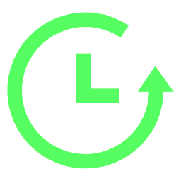

# Search Result Latency Display

## DelayHelper

  

### [中文文档](/docs/README.zh.md)

A Chrome/Edge extension that displays the latency of websites directly next to search results on Google and Bing.

## ✨ Features

- Show real-time latency next to each search result
- Dynamic background color (green / yellow / red) depending on delay
- Adjustable font size, colors, brightness, and fade-in animation
- Settings are synced across devices
- Preview panel in popup

## 📦 Installation

1. Download the latest `.zip` from [Releases](../../releases).
2. Unzip it.
3. Open `chrome://extensions/` (or `edge://extensions/`).
4. Enable **Developer Mode**.
5. Click **Load unpacked** and select the folder.

## 📷 Screenshots

_Search_

_Settings Interface_

## ⚙️ Usage

- Open the popup to configure font size, color, brightness, dynamic coloring, fade-in animation, etc.
- Changes apply after refreshing the search page.

## 📜 License

MIT License
