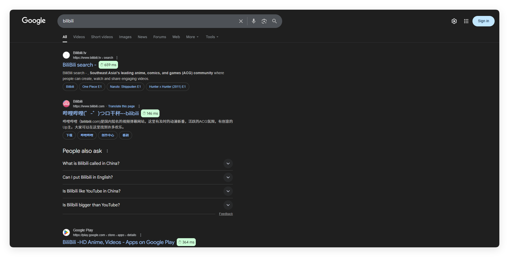
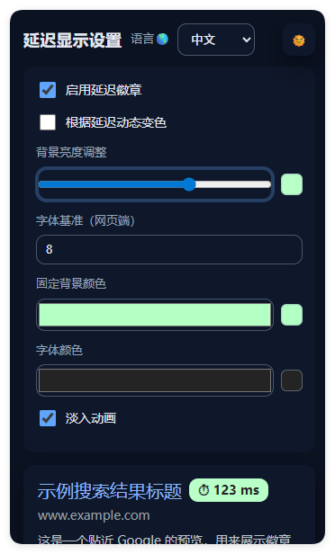

# 搜索结果延迟显示

## 延迟帮助

  

### [English Docs](README.md)

这是一个 Chrome/Edge 浏览器扩展，可以在 Google 和 Bing 搜索结果旁边直接显示网站延迟。

## ✨ 功能

- 在搜索结果旁实时显示延迟
- 根据延迟动态改变背景颜色（绿/黄/红）
- 可调节字体大小、颜色、亮度和淡入动画
- 设置可跨设备同步
- 弹出页内置预览面板

## 📦 安装方法

1. 从 [Releases](../../releases) 下载最新的 `.zip` 包。
2. 解压缩。
3. 打开 `chrome://extensions/` （或 `edge://extensions/`）。
4. 打开 **开发者模式**。
5. 点击 **加载已解压的扩展程序**，选择解压后的文件夹。

## 📷 截图

_搜索_

_设置界面_

## ⚙️ 使用说明

- 点击右上角扩展图标，打开设置页面，调节字体大小、颜色、亮度、动态颜色和淡入效果。
- 设置修改后，刷新搜索结果页面即可生效。

## 📜 开源协议

MIT License
